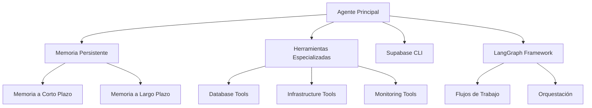
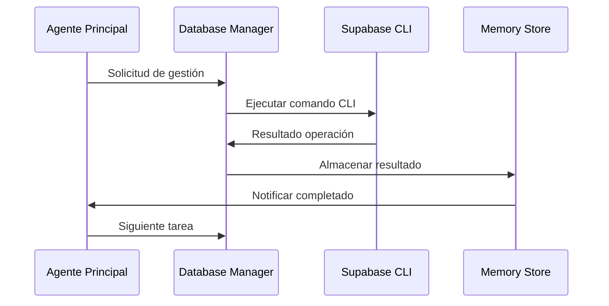
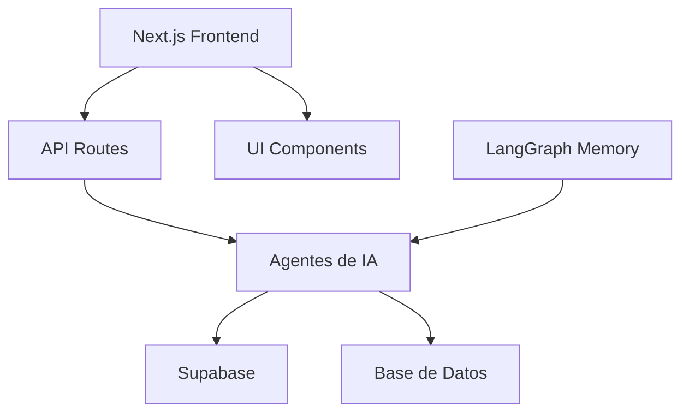

<!-- OPENSPEC:START -->
# OpenSpec Instructions

These instructions are for AI assistants working in this project.

Always open `@/openspec/AGENTS.md` when the request:
- Mentions planning or proposals (words like proposal, spec, change, plan)
- Introduces new capabilities, breaking changes, architecture shifts, or big performance/security work
- Sounds ambiguous and you need the authoritative spec before coding

Use `@/openspec/AGENTS.md` to learn:
- How to create and apply change proposals
- Spec format and conventions
- Project structure and guidelines

Keep this managed block so 'openspec update' can refresh the instructions.

<!-- OPENSPEC:END -->

# Agents.md - Documentación de Agentes de IA para Proyecto Puente

## Tabla de Contenidos

1. [Introducción](#introducción)
2. [Arquitectura de Agentes](#arquitectura-de-agentes)
3. [LangGraph Framework](#langgraph-framework)
4. [Gestión de Memoria](#gestión-de-memoria)
5. [Herramientas (Tools)](#herramientas-tools)
6. [Automatización de Base de Datos con Supabase CLI](#automatización-de-base-de-datos-con-supabase-cli)
7. [Flujos de Trabajo Automatizados](#flujos-de-trabajo-automatizados)
8. [Mejores Prácticas](#mejores-prácticas)
9. [Ejemplos de Implementación](#ejemplos-de-implementación)
10. [Métricas y Monitoreo](#métricas-y-monitoreo)
11. [Integración con Frontend Next.js](#integración-con-frontend-nextjs)
12. [Flujos Específicos del Proyecto](#flujos-específicos-del-proyecto)

## Introducción

Este documento describe la arquitectura, implementación y mejores prácticas para agentes de IA especializados en gestión de bases de datos y automatización de infraestructura. Los agentes están diseñados para operar con frameworks como LangGraph, integrarse con Supabase CLI y mantener memoria persistente para operaciones complejas.

### Propósito

- Automatizar tareas repetitivas de gestión de bases de datos
- Proporcionar inteligencia en la toma de decisiones de infraestructura
- Mantener contexto histórico para operaciones continuas
- Facilitar la escalabilidad de operaciones mediante agentes especializados

## Arquitectura de Agentes

### Componentes Principales



### Patrones de Diseño

- **Agente Reactivo**: Responde a eventos y cambios en el entorno
- **Agente Proactivo**: Inicia acciones basadas en objetivos y planes
- **Sistema Multi-Agente**: Colaboración entre agentes especializados
- **Agente Híbrido**: Combina reactividad y proactividad

## LangGraph Framework

### Descripción

LangGraph es un framework de orquestación para construir agentes de IA estatales y multi-agente con ejecución duradera, memoria integral y capacidades humanas en el bucle.

### Características Clave

- **Ejecución Durable**: Los agentes pueden mantener estado a través de múltiples interacciones
- **Memoria Integral**: Soporte para diferentes tipos de memoria (corto y largo plazo)
- **Multi-Agente**: Capacidad para orquestar múltiples agentes especializados
- **Persistencia**: Estado persistente a través de checkpoints
- **Streaming**: Soporte para flujos de datos en tiempo real

### Implementación Básica

```python
from langgraph.graph import StateGraph, END
from langgraph.prebuilt import create_react_agent
from langgraph.checkpoint.memory import InMemorySaver

# Definir el estado del agente
class AgentState:
    messages: list
    database_context: dict
    infrastructure_state: dict

# Crear el grafo
builder = StateGraph(AgentState)
builder.add_node("database_manager", database_management_node)
builder.add_node("infrastructure_manager", infrastructure_management_node)
builder.add_node("coordinator", coordinator_node)

# Definir el flujo
builder.add_edge("database_manager", "coordinator")
builder.add_edge("infrastructure_manager", "coordinator")
builder.add_edge("coordinator", END)

# Compilar con checkpoint
memory = InMemorySaver()
graph = builder.compile(checkpointer=memory)
```

## Gestión de Memoria

### Tipos de Memoria

#### Memoria a Corto Plazo (State)
- Contexto de la conversación actual
- Estado de operaciones en progreso
- **Agente Predictivo**: Utiliza análisis predictivo para optimizar inventario y precios
- **Agente Validador**: Implementa validaciones automáticas para prevenir errores
- Información temporal para tareas específicas

```python
from langgraph.prebuilt import InjectedState

def database_operation_tool(state: InjectedState):
    current_context = state["messages"]
    # Operar con el contexto actual
    return execute_operation(current_context)
```

#### Memoria a Largo Plazo (Store)
- Historial de operaciones
- Configuraciones persistentes
- Patrones de comportamiento
- Conocimiento acumulado

```python
from langgraph.store.memory import InMemoryStore
from typing_extensions import TypedDict

class DatabaseSchema(TypedDict):
    name: str
    tables: list
    last_updated: str

# Inicializar store
store = InMemoryStore()

# Guardar información persistente
store.put(("databases",), "main_db", DatabaseSchema(
    name="production_db",
    tables=["users", "products", "orders"],
    last_updated="2024-01-15"
))

# Recuperar información
db_info = store.get(("databases",), "main_db")
```

### Estrategias de Memoria

1. **Sumarización**: Resumir historial de mensajes para mantener contexto relevante
2. **Búsqueda Semántica**: Recuperar información basada en similitud de contenido
3. **Memoria Procedimental**: Auto-reflexión y actualización de instrucciones

```python
def update_instructions(state, store):
    namespace = ("instructions",)
    current_instructions = store.search(namespace)[0]
    
    # Lógica de memoria
    prompt = f"""
    Instrucciones actuales: {current_instructions.value["instructions"]}
    Conversación: {state["messages"]}
    
    Genera nuevas instrucciones mejoradas:
    """
    
    new_instructions = llm.invoke(prompt)
    store.put(("agent_instructions",), "db_manager", {
        "instructions": new_instructions
    })
```

## Herramientas (Tools)

### Categorías de Herramientas

#### Herramientas de Base de Datos
- Migraciones y esquemas
- Consultas y análisis
- Optimización de rendimiento
- Copias de seguridad

```python
@tool
def execute_migration(migration_name: str, database_url: str) -> str:
    """Ejecuta una migración de base de datos."""
    import subprocess
    result = subprocess.run([
        "supabase", "db", "push", 
        "--db-url", database_url,
        "--migration", migration_name
    ], capture_output=True, text=True)
    return result.stdout

@tool
def analyze_query_performance(query: str, database_url: str) -> dict:
    """Analiza el rendimiento de una consulta SQL."""
    # Conectar y analizar
    return {
        "execution_time": "120ms",
        "rows_examined": 15000,
        "suggestions": ["Agregar índice en columna X"]
    }
```

#### Herramientas de Infraestructura
- Gestión de servidores
- Monitorización de recursos
- Escalado automático
- Gestión de almacenamiento

```python
@tool
def check_database_health(project_id: str) -> dict:
    """Verifica la salud de la base de datos."""
    return {
        "connection_status": "healthy",
        "cpu_usage": "45%",
        "memory_usage": "67%",
        "disk_usage": "82%"
    }

@tool
def create_backup(database_url: str) -> str:
    """Crea una copia de seguridad de la base de datos."""
    # Implementación de backup
    return "Backup completed successfully"
```

#### Herramientas de Monitorización
- Métricas de rendimiento
- Alertas y notificaciones
- Análisis de logs
- Reportes automáticos

### Integración con Supabase CLI

```python
@tool
def supabase_cli_command(command: str, args: list) -> str:
    """Ejecuta comandos de Supabase CLI."""
    import subprocess
    result = subprocess.run(
        ["supabase"] + [command] + args,
        capture_output=True, text=True
    )
    return result.stdout

# Ejemplos de comandos
supabase_cli_command("db", ["pull"])
supabase_cli_command("db", ["push"])
supabase_cli_command("migration", ["list"])
```

## Automatización de Base de Datos con Supabase CLI

### Flujos de Trabajo Comunes

#### Migraciones de Base de Datos

```bash
# Flujo automatizado de migraciones
supabase db pull                    # Obtener cambios del entorno remoto
supabase db diff --schema public    # Generar migración
supabase db push                    # Aplicar migración localmente
supabase db push --linked           # Aplicar migración al entorno remoto
```

#### Gestión de Esquemas

```python
def automated_schema_management():
    # 1. Verificar estado actual
    current_schema = execute_command("supabase db pull")
    
    # 2. Generar diferencias
    diff = execute_command("supabase db diff")
    
    # 3. Aplicar cambios
    if diff:
        execute_command("supabase db push")
        execute_command("supabase db push --linked")
    
    # 4. Verificar integridad
    health_check = execute_command("supabase inspect db-calls")
    return health_check
```

#### Monitorización y Diagnóstico

```python
def database_monitoring():
    # Inspeccionar bloqueos
    blocking_queries = execute_command("supabase inspect db-blocking")
    
    # Verificar índices no utilizados
    unused_indexes = execute_command("supabase inspect db-unused-indexes")
    
    # Analizar consultas lentas
    slow_queries = execute_command("supabase inspect db-outliers")
    
    return {
        "blocking": blocking_queries,
        "indexes": unused_indexes,
        "outliers": slow_queries
    }
```

## Flujos de Trabajo Automatizados

### Flujo de Gestión de Base de Datos



### Ejemplo de Flujo Completo

```python
def database_management_workflow():
    # 1. Verificar estado
    health = check_database_health()
    
    # 2. Gestionar migraciones
    if needs_migration():
        apply_migrations()
    
    # 3. Optimizar rendimiento
    if performance_issues():
        optimize_queries()
    
    # 4. Crear copias de seguridad
        create_backup()
    
    # 5. Registrar en memoria
    log_operation("Database maintenance completed")
```

## Mejores Prácticas

### Diseño de Agentes

1. **Especialización**: Cada agente debe tener un dominio específico
2. **Resiliencia**: Manejo de errores y recuperación de fallos
3. **Eficiencia**: Minimizar llamadas innecesarias a herramientas
4. **Seguridad**: Validación de entradas y control de acceso

### Gestión de Memoria

1. **Jerarquía de Memoria**: Diferenciar entre memoria corta y larga
2. **Actualización Proactiva**: Refinar instrucciones basadas en experiencia
3. **Límites de Contexto**: Evitar sobrecarga de información
4. **Persistencia Selectiva**: Almacenar solo información relevante

### Integración con Supabase

1. **Autenticación Segura**: Usar tokens y credenciales seguras
2. **Gestión de Errores**: Manejo robusto de fallos en CLI
3. **Registro de Operaciones**: Trazabilidad de todos los comandos
4. **Validación de Resultados**: Verificar éxito de operaciones

### Patrones de Comunicación

```python
def coordinator_node(state):
    # Recopilar entradas de agentes especializados
    db_status = state["database_status"]
    infra_status = state["infrastructure_status"]
    
    # Tomar decisiones basadas en múltiples entradas
    if db_status["critical"] or infra_status["critical"]:
        return escalate_to_human()
    
    # Coordinar acciones
    return plan_next_actions(db_status, infra_status)
```

## Ejemplos de Implementación

### Agente de Gestión de Base de Datos

```python
class DatabaseManagementAgent:
    def __init__(self, store, llm):
        self.store = store
        self.llm = llm
        self.tools = [
            execute_migration,
            analyze_query_performance,
            check_database_health,
            create_backup
        ]
    
    def run(self, query):
        # Recuperar contexto
        context = self.get_context()
        
        # Ejecutar agente con memoria
        agent = create_react_agent(
            model=self.llm,
            tools=self.tools,
            store=self.store,
            state_schema=DatabaseState
        )
        
        return agent.invoke({
            "messages": [{"role": "user", "content": query}],
            "context": context
        })
    
    def get_context(self):
        # Recuperar información de memoria
        return self.store.get(("context",), "database_management")
```

### Agente de Infraestructura

```python
class InfrastructureAgent:
    def __init__(self, store, llm):
        self.store = store
        self.llm = llm
    
    def monitor_resources(self):
        # Obtener métricas
        metrics = self.collect_metrics()
        
        # Analizar y tomar decisiones
        if metrics["cpu_usage"] > 80:
            self.scale_resources()
        
        # Registrar en memoria
        self.store.put(
            ("infrastructure",),
            "last_check",
            {"timestamp": datetime.now(), "metrics": metrics}
        )
    
    def scale_resources(self):
        # Implementar escalado automático
        pass
```

## Métricas y Monitoreo

### KPIs de Agentes

- **Tasa de Éxito**: Porcentaje de operaciones completadas exitosamente
- **Tiempo de Respuesta**: Velocidad de respuesta a solicitudes
- **Eficiencia**: Número de herramientas utilizadas por operación
- **Aprendizaje**: Mejora en el rendimiento a lo largo del tiempo

### Monitorización de Base de Datos

```python
def database_kpis():
    return {
        "query_performance": {
            "avg_execution_time": "120ms",
            "slow_queries": 5,
            "index_usage": "95%"
        },
        "availability": {
            "uptime": "99.9%",
            "backup_success_rate": "100%"
        },
        "security": {
            "failed_logins": 0,
            "schema_changes": 3
        }
    }
```

### Reportes Automatizados

```python
def generate_weekly_report():
    # Recopilar datos de la semana
    operations = get_weekly_operations()
    performance = get_performance_metrics()
    issues = get_resolved_issues()
    
    # Generar reporte
    report = f"""
    Reporte Semanal de Agentes de Base de Datos
    ========================================
    
    Operaciones realizadas: {len(operations)}
    Tiempo de actividad: 99.9%
    Problemas resueltos: {len(issues)}
    Mejoras de rendimiento: {performance['improvements']}
    
    Próximos pasos:
    - Revisar índices no utilizados
    - Planificar migraciones pendientes
    """
    
    return report
```

## Integración con Frontend Next.js

### Arquitectura del Proyecto Puente



### Conexión con Agentes

```typescript
// src/app/api/agents/route.ts
import { DatabaseAgent } from '@/lib/agents/database-agent';

export async function POST(request: Request) {
  const { action, data } = await request.json();

  const agent = new DatabaseAgent();
  const result = await agent.execute(action, data);

  return Response.json(result);
}
```

### Agentes Especializados para el Proyecto

```typescript
// src/lib/agents/inventory-agent.ts
export class InventoryManagementAgent {
  // Agent especializado para gestión de inventario
  // - Ingreso de mercancía
  // - Análisis de stock
  // - Recomendaciones de compra
}

// src/lib/agents/pos-agent.ts
export class POSAgent {
  // Agent especializado para Punto de Venta
  // - Análisis de ventas
  // - Optimización de productos
  // - Detección de fraudes
}

// src/lib/agents/repair-agent.ts
export class RepairManagementAgent {
  // Agent especializado para reparaciones
  // - Diagnóstico de problemas
  // - Optimización de procesos
  // - Estimación de costos
}
```

## Flujos Específicos del Proyecto

### 1. Agente de Ingreso de Mercancía

```python
class StockEntryAgent:
    def __init__(self):
        self.supabase_client = get_supabase_client()
        self.product_categories = [
            "celular-seminuevo",
            "mica",
            "accesorios"
        ]

    @tool
    def validate_product_entry(self, product_data: dict) -> dict:
        """Valida datos de entrada de producto."""
        errors = []

        # Validar campos requeridos
        if not product_data.get("name"):
            errors.append("El nombre es requerido")
        if not product_data.get("sku"):
            errors.append("El SKU es requerido")
        if product_data.get("cost", 0) <= 0:
            errors.append("El costo debe ser mayor a 0")

        # Validar atributos específicos por categoría
        if product_data.get("category") == "celular-seminuevo":
            if not product_data.get("attributes", {}).get("color"):
                errors.append("El color es requerido para celulares")
            if not product_data.get("attributes", {}).get("memoria"):
                errors.append("La memoria es requerida para celulares")

        elif product_data.get("category") == "mica":
            alto = product_data.get("attributes", {}).get("alto")
            ancho = product_data.get("attributes", {}).get("ancho")
            if not alto or not ancho:
                errors.append("Alto y ancho son requeridos para micas")

        return {"valid": len(errors) == 0, "errors": errors}

    @tool
    def create_product_with_category(self, product_data: dict) -> dict:
        """Crea producto con categoría específica."""
        # Preparar payload para Supabase
        payload = {
            "name": product_data["name"],
            "sku": product_data["sku"],
            "price": product_data["price"],
            "cost": product_data["cost"],
            "stock": product_data["quantity"],
            "type": "Venta",
            "ownership_type": product_data["ownershipType"],
            "category": product_data.get("category"),
            "attributes": product_data.get("attributes", {}),
            "search_keywords": self.generate_keywords(product_data["name"])
        }

        # Insertar en base de datos
        result = self.supabase_client.table("products").insert(payload).execute()

        # Registrar en logs de inventario
        self.supabase_client.table("inventory_logs").insert({
            "product_id": result.data[0]["id"],
            "product_name": product_data["name"],
            "change": product_data["quantity"],
            "reason": "Ingreso de Mercancía",
            "metadata": {
                "category": product_data.get("category"),
                "attributes": product_data.get("attributes")
            }
        }).execute()

        return result.data[0]

    @tool
    def analyze_inventory_trends(self, days: int = 30) -> dict:
        """Analiza tendencias de inventario."""
        # Consultar productos con bajo stock
        low_stock = self.supabase_client.rpc(
            "get_low_stock_products",
            {"days": days}
        ).execute()

        # Analizar categorías más vendidas
        top_categories = self.supabase_client.rpc(
            "get_top_selling_categories",
            {"days": days}
        ).execute()

        return {
            "low_stock": low_stock.data,
            "top_categories": top_categories.data,
            "recommendations": self.generate_stock_recommendations(low_stock.data)
        }
```

### 2. Agente de Compatibilidad de Micas

```python
class MicaCompatibilityAgent:
    def __init__(self):
        self.supabase_client = get_supabase_client()

    @tool
    def find_compatible_micas(self, device_dimensions: dict) -> list:
        """Busca micas compatibles con las dimensiones del dispositivo."""
        alto = device_dimensions["alto"]
        ancho = device_dimensions["ancho"]

        # Buscar micas que sean exactas o más pequeñas
        micas = self.supabase_client.rpc(
            "find_compatible_micas",
            {"alto": alto, "ancho": ancho}
        ).execute()

        # Ordenar por exactitud
        micas.data.sort(key=lambda x: (
            abs(x["attributes"]["alto"] - alto) +
            abs(x["attributes"]["ancho"] - ancho)
        ))

        return micas.data

    @tool
    def calculate_coverage_area(self, mica_dims: dict, device_dims: dict) -> float:
        """Calcula el área de cobertura."""
        mica_area = mica_dims["alto"] * mica_dims["ancho"]
        device_area = device_dims["alto"] * device_dims["ancho"]
        return (mica_area / device_area) * 100
```

### 3. Agente de Optimización de Precios

```python
class PricingOptimizationAgent:
    def __init__(self):
        self.supabase_client = get_supabase_client()

    @tool
    def analyze_profit_margins(self) -> dict:
        """Analiza márgenes de profit por categoría."""
        products = self.supabase_client.table("products").select(
            "category", "price", "cost", "stock"
        ).execute()

        analysis = {}
        for product in products.data:
            category = product.get("category", "sin_categoría")
            margin = ((product["price"] - product["cost"]) / product["price"]) * 100

            if category not in analysis:
                analysis[category] = {
                    "total_products": 0,
                    "avg_margin": 0,
                    "total_stock": 0,
                    "low_margin_items": []
                }

            analysis[category]["total_products"] += 1
            analysis[category]["avg_margin"] += margin
            analysis[category]["total_stock"] += product["stock"]

            if margin < 20:  # Margen menor al 20%
                analysis[category]["low_margin_items"].append({
                    "name": product["name"],
                    "sku": product["sku"],
                    "margin": margin,
                    "suggested_price": product["cost"] * 1.25
                })

        # Calcular promedios
        for category in analysis:
            if analysis[category]["total_products"] > 0:
                analysis[category]["avg_margin"] /= analysis[category]["total_products"]

        return analysis

    @tool
    def suggest_price_adjustments(self, category: str, target_margin: float) -> list:
        """Sugiere ajustes de precios para alcanzar margen objetivo."""
        products = self.supabase_client.table("products").select(
            "id", "name", "sku", "price", "cost", "stock"
        ).eq("category", category).execute()

        suggestions = []
        for product in products.data:
            current_margin = ((product["price"] - product["cost"]) / product["price"]) * 100
            if current_margin < target_margin:
                new_price = product["cost"] / (1 - target_margin / 100)
                suggestions.append({
                    "id": product["id"],
                    "name": product["name"],
                    "current_price": product["price"],
                    "current_margin": current_margin,
                    "suggested_price": round(new_price, 2),
                    "potential_increase": round(new_price - product["price"], 2)
                })

        return suggestions
```

### 4. Agente de Análisis de Ventas

```python
class SalesAnalysisAgent:
    def __init__(self):
        self.supabase_client = get_supabase_client()

    @tool
    def generate_daily_report(self, date: str) -> dict:
        """Genera reporte diario de ventas."""
        # Obtener ventas del día
        sales = self.supabase_client.table("sales").select("*")
            .gte("created_at", date)
            .lt("created_at", f"{date}T23:59:59")
            .execute()

        # Analizar por método de pago
        payment_methods = {}
        total_sales = 0

        for sale in sales.data:
            method = sale["payment_method"]
            if method not in payment_methods:
                payment_methods[method] = {"count": 0, "total": 0}
            payment_methods[method]["count"] += 1
            payment_methods[method]["total"] += sale["total_amount"]
            total_sales += sale["total_amount"]

        # Top productos vendidos
        top_products = self.analyze_top_products(sales.data)

        return {
            "date": date,
            "total_sales": total_sales,
            "total_transactions": len(sales.data),
            "payment_methods": payment_methods,
            "top_products": top_products,
            "average_transaction": total_sales / len(sales.data) if sales.data else 0
        }
```

## Conclusión

Esta documentación proporciona una guía completa para la implementación de agentes de IA en el Proyecto Puente. La arquitectura basada en Next.js, Supabase y LangGraph permite crear sistemas inteligentes que optimizan las operaciones del negocio.

### Características Únicas del Proyecto

1. **Sincronización Automática**: Los agentes mantienen sincronizada la base de datos con el frontend
2. **Validación Inteligente**: Detección automática de errores y anomalías
3. **Optimización de Procesos**: Análisis y mejora continua de flujos de trabajo
4. **Memoria Contextual**: Los agentes aprenden de operaciones pasadas para mejorar futuras interacciones

### Recomendaciones Finales

1. **Integración Gradual**: Implementar agentes módulo por módulo
2. **Validación Continua**: Monitorear y ajustar agentes basado en retroalimentación
3. **Seguridad Primero**: Implementar validaciones robustas en todas las operaciones
4. **Documentación Viva**: Mantener documentación actualizada con cada mejora
5. **Testing Riguroso**: Probar agentes en entornos controlados antes de producción

---

*Documento generado específicamente para el Proyecto Puente con agentes de IA especializados.*